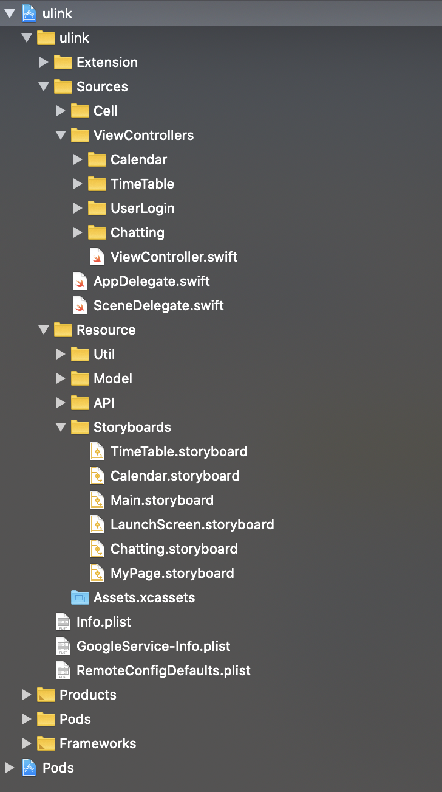

# 폴더링🗂

## Extension
➡️ 

## Sources
➡️ swift 파일   

Cell : CollectionView, TableView Cell 관련 swift 파일   
ViewControllers ( 기능별로 폴더링 ): View에 연결된 swift 파일 

## Resource
➡️ 

Util :    
Model :    
API :    
StoryBoards ( 기능별로 폴더링 )