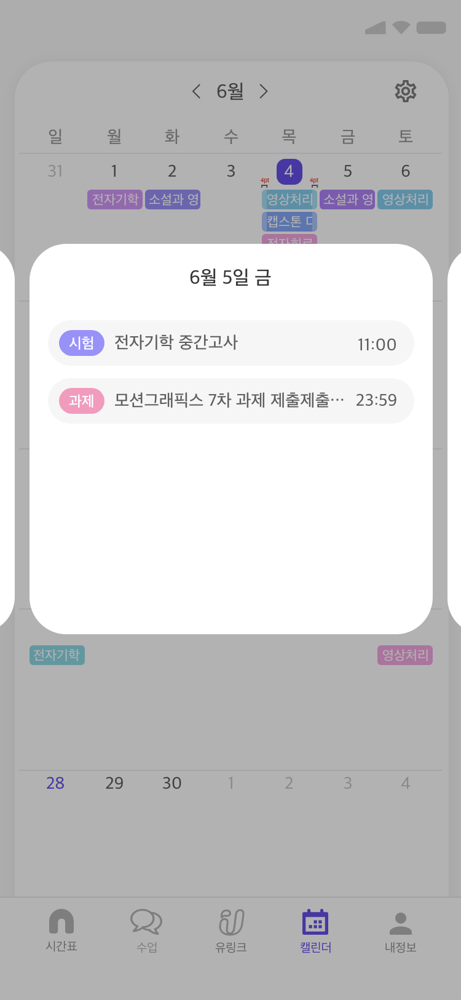
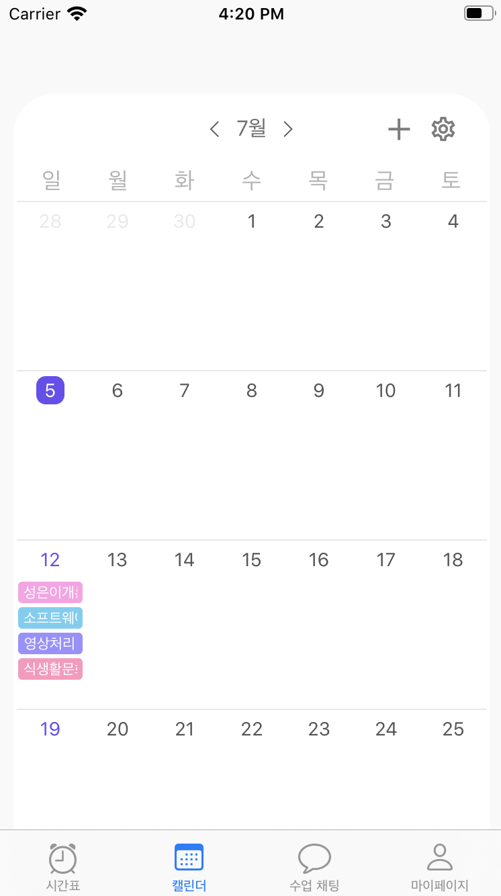
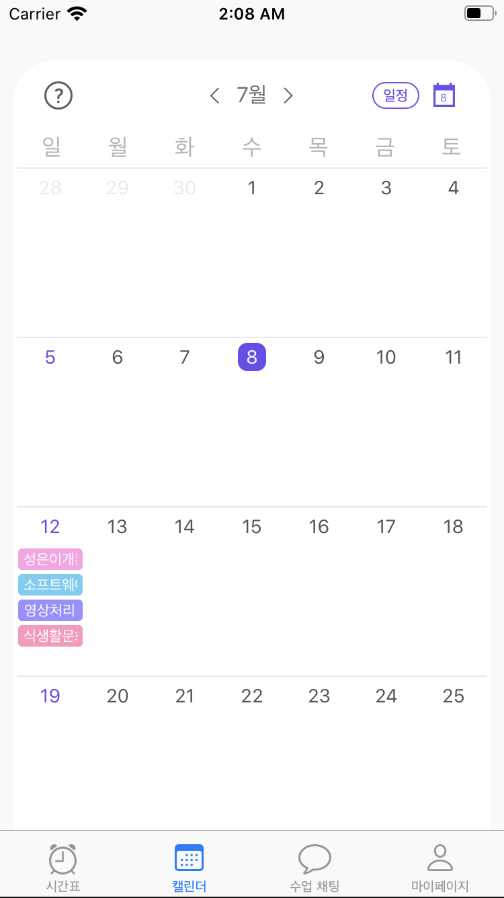
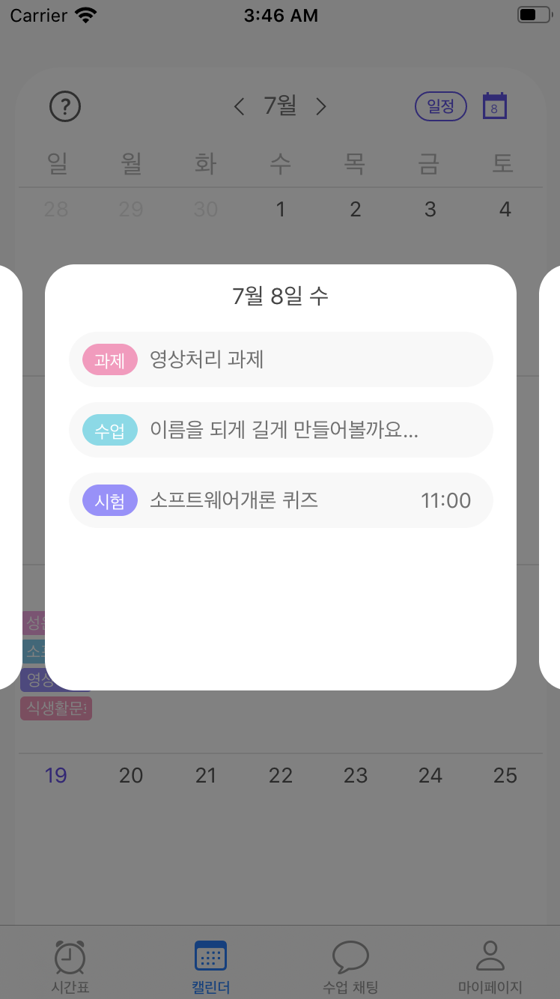
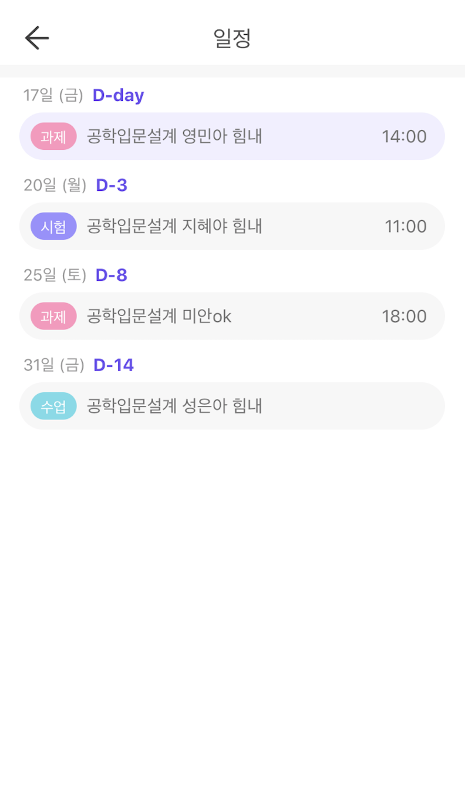
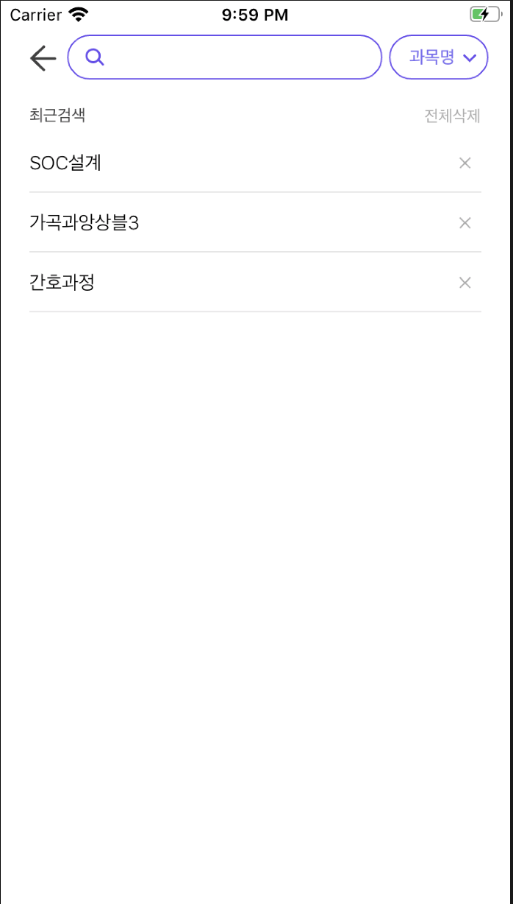
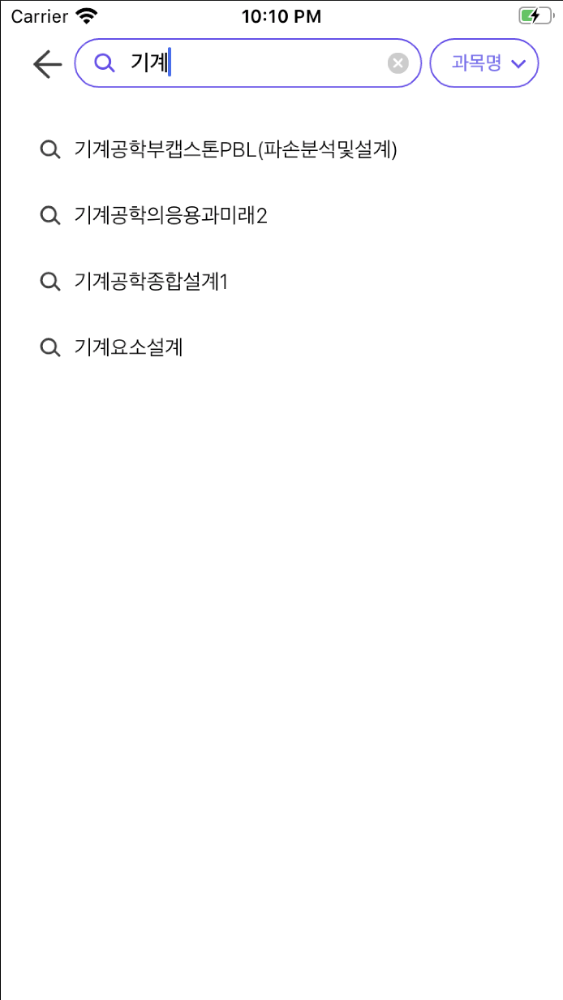
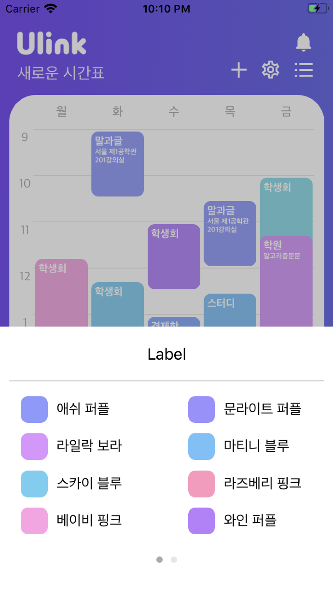

# Ulink-iOS 성은's Work ❣️🌝❣️

## CalendarView🗓


###  사전준비
- #### 캘린더뷰 디자인   
  
  

- #### 일정 세부 팝업 창 디자인
  
  

- #### 해야할 일

  |  1. 전체 캘린더 짜기  |       | | 2. 달력에서 일정 보여주기 |    |   | 3. 날짜 클릭 이벤트| |
  | ----    | ---- | ---- | ----|----|----|----|----|
  |레이아웃 |    🙆‍♀️ |   |   서버 통신 (과목 정보 데이터) | 🙅‍♀️| |셀 클릭하면 일정 세부 뷰 띄우기 | 🙆‍♀️|
  | 다음달, 이전달 버튼 |   🙆‍♀️  | |해당 날짜에 해당 색깔로 이름 일정 찍기 | 🙆‍♀️ |  |일정 데이터 세부 정보 리스트|🙆‍♀️|
  |    윤달 설정 |   🙆‍♀️  |  | | | |일정 클릭하면 어디론가 이동하기|🙅‍♀️|
  |이전달, 다음달 placeholder|🙆‍♀️| | | | |스와이프해서 전 날, 다음 날 보여주기 |🙅‍♀️|
  |일요일 숫자 색깔 다르게|🙆‍♀️| | | | |일정 클릭하면 어디론가 이동하기|🙅‍♀️|


###  개발내용
- #### ~~라이브러리 삽질~~  

    캘린더 라이브러리 : "FSCalendar"   
    ➡️ [FSCalendar 라이브러리 github](https://github.com/WenchaoD/FSCalendar)   
    캘린더가 완벽하게 구현되어 있고 어느정도 커스텀이 가능하다는 특징!   

     FSCalendar 라이브러리를 열어서 씹고 뜯고 맛보기   
     
    
    #### <테스트 해본 결과>
        

     디자인 일정 부분 변경, 이벤트 추가 등이 가능했지만 디자인단에서 원하는 뷰를 만들기에는 어려움이 있었다.   
     결국 FSCalendar는 사용하지 않기로... 😈

     어려웠던점 👉 파일을 고쳐보고 싶었는데 수정해도 결과가 반영되지 않았다.. 이유를 모르겠다.. (그러나 직접 만든 뷰가 더 맘에 든다..!)

***

- #### CollectionView로 캘린더 처음부터 짜기
  
  - 월 별 날짜 수를 배열로 저장
  ``` swift
  var numOfDate = [31, 28, 31, 30, 31, 30, 31, 31, 30, 31, 30, 31]
  ```
  - 윤년 설정   
    4년에 한번 2월의 일 수를 29로 변경
  ``` swift
  if (todayYear % 4 == 0){
            numOfDate[1] = 29
        } else {
            numOfDate[1] = 28
        }
  ```

  - 캘린더를 처음 열었을 때 오늘 날짜의 달을 띄워주기 위해 오늘 날짜(today)를 알아내고 현재 페이지 날짜(current)에 저장   
  다음달, 이전달 버튼을 터치하면 current 변수를 1씩 변경

  - 1일의 요일을 알아내기   
  (일요일 - 1, 월요일 - 2 ... 값을 return)
  ``` swift
  func getFirstWeekDay() -> Int{
        let dateFormatter = DateFormatter()
        dateFormatter.dateFormat = "dd-M-yyyy"
        let dateString = "01-" + String(currentMonth) + "-" + String(currentYear)
        let myDay = dateFormatter.date(from: dateString)
        let first = cal.dateComponents([.weekday], from: myDay!)
        
        let firstWeekDay = first.weekday!
        return firstWeekDay
  }
  ```

  - 전체 cell 개수
    이전달 placeholder와 이번달 일 수의 합이 
    - 28이면 cell 수는 28
    - 35보다 크면 cell 수는 42
    - 나머지는 cell 수 35

  - cell 날짜 찍는 함수   
  textColor 변수로 글자 색 구분   
     * 저번달, 다음달 placeholder : 회색 글씨
     * 오늘 날짜 : 흰색 글씨 + 보라색 배경
     * 일요일 : 보라색 글씨
     * 나머지 : 검정색 글씨
  ```swift
  func setDayCell(firstDay: Int, textColor: Int)
  ```

  - 날짜 구분 조건   
     * 이전달 placeholder
     ```swift
     indexPath.row >= 0 && indexPath.row < first
     ```
     * 이번달
     ```swift
     indexPath.row >= first && indexPath.row < last + first
     ```
     * 이번달 토요일
     ```swift
     (indexPath.row % 7) == 0
     ```
     * 이번달 오늘
     ```swift
     ((indexPath.row - first + 1) == todayDate) && (currentMonth == todayMonth) && (currentYear == todayYear)
     ```
     * 다음달 placeholder - else

  - 일정 제목 padding   
    디자인적으로 padding이 필요해서 UILabel에 padding 넣는 방법을 찾다가 inset 설정이 있는 UIButton에 사용자 interaction enabled를 해제해서 사용

  - cell에 일정 추가하는 함수   
  날짜, eventName 배열, color 배열을 서버에서 받아서 해당 날짜에 개수만큼 일정을 찍어준다.
  ```swift
  func setEvent(eventName: [String], color: [UIColor])
  ```

     #### <여기까지 뷰 완성본>
     

   
   __어려웠던 점__   
   👉 cell 레이아웃 잡는 것이 어려웠다. collection view flow layout을 통해 cell 크기를 지정해줬는데 왜 cell 안의 내용물에 따라 크기가 변할까..?   
   __새로 배운 점__    
   👉 달력처럼 하나의 collection view를 계속 reload 해줘야하는 경우에는 뷰 설정을 계속 초기화 해주는 것이 이상한 오류가 안 일어난다는 것!


***   
- #### 뷰 수정(07/06)
  #### 오늘이 포함된 달로 돌아오는 버튼 추가

  - current 변수를 today 변수로 변경 후 collection view reload
  ```swift
  @IBAction func backToToday(_ sender: Any) {
      currentMonth = todayMonth
      monthLabel.text = String(currentMonth) + "월"
      calendarCollectionView.reloadData()
  }
  ```

  - 버튼 이미지를 배경으로 깔고, text는 오늘 날짜로

  #### <여기까지 뷰 완성본>
  

***

- #### 날짜 셀 클릭 이벤트


  - 팝업 창 띄우기   
  새로운 VC ! (DetailEventViewController)   
  배경 검정색으로 지정 후 opacity까지 지정해줌

    calendar view 위에 overCurrentContext 설정으로 modal 띄워주기
  ```swift
    func collectionView(_ collectionView: UICollectionView, didSelectItemAt indexPath: IndexPath) {
        guard let popUpVC = self.storyboard?.instantiateViewController(identifier: "detailEvent") as? DetailEventViewController else {return}

        popUpVC.modalPresentationStyle = .overCurrentContext
        present(popUpVC, animated: false, completion: nil)
    }
    ```

  - 빈 부분 클릭하면 팝업 창 닫기   
  touch한 부분이 collection view가 아니면 팝업 창 dismiss
  ```swift
  override func touchesBegan(_ touches: Set<UITouch>, with event: UIEvent?)
    {
        let touch = touches.first
        if touch?.view != self.detailEventCollectionView
        { self.dismiss(animated: false, completion: nil) }
    }
  ```
  - calendar view에서 서버로부터 데이터를 받아 detail event view로 넘겨줄 예정   
    일단 더미 데이터를 띄워보았다😲   
    일정 찍는 함수   
    날짜 제목값, 이벤트 배열, 카테고리 배열, 시간 배열을 넣어서 데이터 변경
  ```swift
  func setEventList(date: String, eventName: [String], category: [Int], time: [String]){
        dateLabel.text = date
        for i in 0...eventName.count-1{
            eventListViews[i].isHidden = false
            eventNameLabels[i].text = eventName[i]
            if (category[i] == 0) {
                categoryLabels[i].setTitle("시험", for: .normal)
                categoryLabels[i].backgroundColor = UIColor.periwinkleBlue
            } else if (category[i] == 1){
                categoryLabels[i].setTitle("수업", for: .normal)
                categoryLabels[i].backgroundColor = UIColor.robinSEgg
            } else {
                categoryLabels[i].setTitle("과제", for: .normal)
                categoryLabels[i].backgroundColor = UIColor.pink
            }
            timeLabels[i].text = time[i]
        }
        
    }
  ```
  #### <여기까지 뷰 완성본>
  

  어려운 점   
  👉 일정을 스와이프 해서 앞 뒤로 띄우는 방법에 대해 많은 고민을 했다   
  새로 배운 점   
  👉 뒤가 어둡게 보이는 팝업 창을 띄우는 법을 알았다

  - 추가사항   
    좌우로 스와이프 했을 때 전날, 다음날의 일정 세부 뷰 보이게   
    calendar view에서 한 달 단위로 배열 형태의 데이터를 넘겨주면 해당 데이터로 collection view cell 만들기

  - 스와이프 했을 때 collection view cell 단위로 셀 넘어가게   
    cell 가로 길이만큼 이동이동   
    대신 존재하는 cell 밖으로 넘어가지 않도록 범위 지정해주기
  ```swift
  @IBAction func swipeLeft(_ sender: Any) {
        let x = self.detailEventCollectionView.bounds.origin.x
        if (x < (self.detailEventCollectionView.frame.width-45) * 2){
            self.detailEventCollectionView.setContentOffset(CGPoint(x: self.detailEventCollectionView.bounds.origin.x + self.detailEventCollectionView.frame.width - 45, y: 0), animated: true)
        }
    }
    
    @IBAction func swipeRight(_ sender: Any) {
        let x = self.detailEventCollectionView.bounds.origin.x
        if (x > 0){
            self.detailEventCollectionView.setContentOffset(CGPoint(x: self.detailEventCollectionView.bounds.origin.x - self.detailEventCollectionView.frame.width + 45, y: 0), animated: true)
        }
    }
  ```

  - calendar view에서 날짜 셀 선택했을 때 해당 날짜의 데이터를 보여주도록 처음 팝업뷰가 뜰 때 collection view의 시작지점을 정해주자   
  x값에 더해지는 부분을 변수로 지정해줄 것
  ```swift
  func collectionView(_ collectionView: UICollectionView, willDisplay cell: UICollectionViewCell, forItemAt indexPath: IndexPath) {
        if (started == false){
            started = true
            self.detailEventCollectionView.setContentOffset(CGPoint(x: self.detailEventCollectionView.bounds.origin.x + self.detailEventCollectionView.frame.width - 45, y: 0), animated: false)
        }
  }
  ```

  
  ~~❗️ 아직 스와이프해서 전날과 다음날의 데이터가 보이는 기능은 구현하지 않았다..! 화이팅 나 자신,,, ❗️~~   
  -> 스와이프 기능은 앱잼에서 구현하지 않기로 결정

  ***
  
- #### 통신
  - 한 달씩 일정 받아와서 캘린더에 뿌려주기  
    일정 모델 decoding 
  ``` swift
    struct CalendarData: Codable {
    
      let status: Int
      let success: Bool
      let message: String
      var data: [SecondData]?
      
      enum CodingKeys: String, CodingKey{
          case status = "status"
          case success = "success"
          case message = "message"
          case data = "data"
      }
      
      init(from decoder: Decoder) throws {
          let values = try decoder.container(keyedBy: CodingKeys.self)
          status = (try? values.decode(Int.self, forKey: .status)) ?? -1
          success = (try? values.decode(Bool.self, forKey: .success)) ?? false
          message = (try? values.decode(String.self, forKey: .message)) ?? ""
          data = (try? values.decode([SecondData].self, forKey: .data)) ?? nil
      }
    }

    struct SecondData: Codable {
      var date: String
      var notice: [NoticeData]?
      
      enum CodingKeys: String, CodingKey{
          case date = "date"
          case notice = "notice"
      }
      
      init(from decoder: Decoder) throws {
          let values = try decoder.container(keyedBy: CodingKeys.self)
          date = (try? values.decode(String.self, forKey: .date)) ?? ""
          notice = (try? values.decode([NoticeData].self, forKey: .notice)) ?? nil
      }
    }

    struct NoticeData: Codable {
      var name: String
      var color: Int
      var noticeIdx: Int
      var category: String
      var startTime: String
      var endTime: String
      var title: String
      
      enum CodingKeys: String, CodingKey{
          case name = "name"
          case color = "color"
          case noticeIdx = "noticeIdx"
          case category = "category"
          case startTime = "startTime"
          case endTime = "endTime"
          case title = "title"
      }
      
      init(from decoder: Decoder) throws {
          let values = try decoder.container(keyedBy: CodingKeys.self)
          name = (try? values.decode(String.self, forKey: .name)) ?? ""
          color = (try? values.decode(Int.self, forKey: .color)) ?? -1
          noticeIdx = (try? values.decode(Int.self, forKey: .noticeIdx)) ?? -1
          category = (try? values.decode(String.self, forKey: .category)) ?? ""
          startTime = (try? values.decode(String.self, forKey: .startTime)) ?? ""
          endTime = (try? values.decode(String.self, forKey: .endTime)) ?? ""
          title = (try? values.decode(String.self, forKey: .title)) ?? ""
      }
  }
    ```
    - 날짜 스트링 비교해서 해당하는 날짜에 일정 띄우기
    - 캘린더 셀 클릭하면 해당 날짜의 이벤트 모델 배열로 넘겨주기
    
    ***
- #### 캘린더 팝업에서 공지 상세뷰 연결
   - 팝업에서 공지 셀을 누르면 공지 상세뷰로 notice idx를 전달하며 present
   ```swift
   guard let popUpVC = sb.instantiateViewController(identifier: "NoticeEditViewController") as? NoticeEditViewController else {return}

  popUpVC.noticeIdx = noticeList?[indexPath.row].noticeIdx as! Int
  popUpVC.modalPresentationStyle = .overCurrentContext
  present(popUpVC, animated: true, completion: nil)
   ```

   - 공지 상세뷰에서 내용을 수정하면 캘린더에서 update 해주기 위해 delegate protocol 설정
  
   - 공지 데이터 별로 보여주는 시간 설정 다르게   
  수업  : x   
  과제 : end time
  시험 : start time

***

## EventListView📌
   개발내용
- #### 리스트 만들기
    - 날짜 표시 셀을 헤더 셀로 설정해서 날짜 별로 공지 셀을 띄움   
    - 날짜 셀 띄우고, 날짜에 해당하는 수만큼 공지 셀 띄우기
  ```swift
  func tableView(_ tableView: UITableView, numberOfRowsInSection section: Int) -> Int {
        return serverData?[section].notice?.count ?? 0
    }
    
  func tableView(_ tableView: UITableView, cellForRowAt indexPath: IndexPath) -> UITableViewCell {
        guard let cell = tableView.dequeueReusableCell(withIdentifier: EventCell.identifier, for: indexPath) as? EventCell else {
        return UITableViewCell() }
        
        if let serverData = serverData?[indexPath.section].notice?[indexPath.row] {
            cell.set(serverData)
        }
        cell.changeViewColor(serverData?[indexPath.section].date ?? "")
        
        return cell
    }
    
  func tableView(_ tableView: UITableView, heightForRowAt indexPath: IndexPath) -> CGFloat {
        return 44
    }
    
  func tableView(_ tableView: UITableView, viewForHeaderInSection section: Int) -> UIView? {
        guard let cell = tableView.dequeueReusableCell(withIdentifier: EventListHeaderCell.identifier) as? EventListHeaderCell else {
        return UITableViewCell() }
        
        if let serverData = serverData?[section] {
            cell.set(serverData)
        }
        
        return cell
    }
    
  func numberOfSections(in tableView: UITableView) -> Int {
        return serverData?.count ?? 0
    }
    ```
  - 디데이 계산
  ```swift
   func getDday(date: String) -> Int{
        let dateFormatter = DateFormatter()
        dateFormatter.dateFormat = "yyyy-MM-dd"
        let myDay = dateFormatter.date(from: date)
        
        let start = cal.startOfDay(for: today)
        let end = cal.startOfDay(for: myDay!)
        
        let components = cal.dateComponents([.day], from: start, to: end)
        return components.day!
    }
  ```
  - 오늘 날짜 공지 색 구별   
    디데이 함수 이용~!    
    디데이가 0이면 백그라운드 색 바꿔주기
  
  ```swift
  func changeViewColor(_ dateInfo: String){
        var dDay = getDday(date: dateInfo)
        if (dDay == 0){
            cellColorView.backgroundColor = UIColor.paleGreyTwo
        }
    }
  ```
  #### <여기까지 뷰 완성본>
  
***

## SearchView🏷
 개발내용
  
- 입력 안하고 있을 때는 최근 검색, 입력할 때는 자동완성
  - header 숨기기, cell 변경
  ```swift
  func textFieldShouldBeginEditing(_ textField: UITextField) -> Bool {
        self.headerView.frame = CGRect(x: 0, y: 0, width: self.headerView.frame.width, height: 0)
        headerView.isHidden = true
        searchTableView.reloadData()
        
        return true
  }

  func tableView(_ tableView: UITableView, cellForRowAt indexPath: IndexPath) -> UITableViewCell {
        guard let cell = tableView.dequeueReusableCell(withIdentifier: SearchedCell.identifier) as? SearchedCell else {
            return UITableViewCell() }
            
        guard let cell2 = tableView.dequeueReusableCell(withIdentifier: RealTimeSearchCell.identifier) as? RealTimeSearchCell else {
        return UITableViewCell() }
        
        
        if headerView.isHidden == true {
            cell2.show(titleString: serverData[indexPath.row])
            return cell2
        } else {
            cell.layer.addBorder(edge: [.bottom], color: UIColor.veryLightPinkTree, thickness: 1)
            cell.set(indexPath.row)
            cell.indexPathNum = indexPath.row
            cell.delegate = self
            return cell
        }
  }
  ```
- 최근 검색   
  - realmSwift 데이터베이스 사용
  ```swift
  if (searchTextField.text != ""){
            try! realm.write {
                realm.add(searchedData)
            }
        }
  ```
  - 삭제 버튼 구현 위해서 delegate protocol 사용
  ```swift
  func didPressDeleteButton(_ tag: Int) {
        let savedDatas = realm.objects(SearchedListData.self)
        let predicate = NSPredicate(format: "searched = %@", savedDatas[tag].searched)

        try! self.realm.write({
            realm.delete(realm.objects(SearchedListData.self).filter(predicate))
        })
        
        searchTableView.reloadData()
    }
  ```
  - 전체 삭제 기능
  #### <여기까지 뷰 완성본>
  

***
- 검색 자동완성
  - 사용자가 글자를 입력할 때마다 서버와 통신해서 tableview 업데이트 해주기
  ```swift
  func textField(_ textField: UITextField, shouldChangeCharactersIn range: NSRange, replacementString string: String) -> Bool {
        currentText = textField.text! + string
        getDataFromServer(currentString: currentText)
        searchTableView.reloadData()
        return true
    }
  ```
  - 통신 코드
  ```swift
  func openRecommendData(word: String, completion: @escaping (CalendarNetworkResult<Any>) -> Void) {
        if let userDefaultToken = UserDefaults.standard.string(forKey: "token") {
            let header: HTTPHeaders = ["Content-Type": "application/json", "token": userDefaultToken]
            
            var query: String = ""
            
            var queryWord = word.addingPercentEncoding(withAllowedCharacters: .urlQueryAllowed) ?? ""
            
            query = "?name=\(queryWord)"
            
            let dataRequest = Alamofire.request(APIConstants.searchURL + query, method: .get, encoding: JSONEncoding.default, headers: header)
            
            dataRequest.responseData { dataResponse in
                switch dataResponse.result {
                case .success:
                    guard let statusCode = dataResponse.response?.statusCode else { return }
                    guard let value = dataResponse.result.value else { return }
                    let networkResult = self.judge(by: statusCode, value)
                    completion(networkResult)
                case .failure: completion(.networkFail)
                }
            }
        }
    }
    ```
    #### <여기까지 뷰 완성본>
  

  __새로 배운 점__    
   👉 ❗️쿼리문에 한글 넣기 위해서는 퍼센트 인코딩 해야함!!!

## ColorPickerView🎨
 개발내용

- 색 선텍 컬렉션 뷰
  - 컬렉션 뷰 페이징 & 페이지 컨트롤
  ```swift
  func scrollViewWillEndDragging(_ scrollView: UIScrollView, withVelocity velocity: CGPoint, targetContentOffset: UnsafeMutablePointer<CGPoint>) {
        let cellWidthIncludeSpacing = colorCollectionView.frame.width

        var offset = targetContentOffset.pointee
        let index = (offset.x + scrollView.contentInset.left) / cellWidthIncludeSpacing
        let roundedIndex: CGFloat = round(index)
        
        pageControl.currentPage = Int(roundedIndex)

        offset = CGPoint(x: roundedIndex * cellWidthIncludeSpacing, y: scrollView.contentInset.top)
        targetContentOffset.pointee = offset
    }
  ```
  #### <여기까지 뷰 완성본>
  